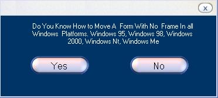

<div align="center">

## \[ a no frame movible form \]


</div>

### Description

This code alows you to move forms that have no frams this is compadible with all windows platforms. only one api call.
 
### More Info
 
Form


<span>             |<span>
---                |---
**Submitted On**   |2002-01-21 14:41:46
**By**             |[Vblifeline](https://github.com/Planet-Source-Code/PSCIndex/blob/master/ByAuthor/vblifeline.md)
**Level**          |Beginner
**User Rating**    |4.7 (84 globes from 18 users)
**Compatibility**  |VB 6\.0
**Category**       |[Graphics](https://github.com/Planet-Source-Code/PSCIndex/blob/master/ByCategory/graphics__1-46.md)
**World**          |[Visual Basic](https://github.com/Planet-Source-Code/PSCIndex/blob/master/ByWorld/visual-basic.md)
**Archive File**   |[\[\_a\_no\_fra502611212002\.zip](https://github.com/Planet-Source-Code/vblifeline-a-no-frame-movible-form__1-31037/archive/master.zip)

### API Declarations

```
Public Declare Function GetCursorPos Lib "user32" (lpPoint As POINTAPI) As Long
```


